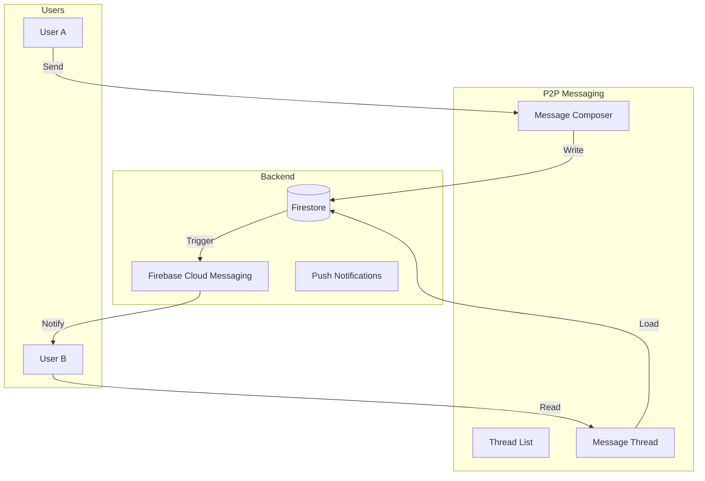

# Peer-to-Peer Messaging Plan

**Feature:** Direct messaging between +AI users  
**Phase:** Post-PWA (Phase 6)  
**Estimated Time:** 15-20 hours

---

## Overview

Enable users to send direct messages to each other, creating a social layer on top of +AI's chat infrastructure.

**Mental Model:**
- Chat with +AI (existing)
- Chat with +AI about someone (profile discovery - done)
- Chat directly with someone (P2P messaging - new)

---

## Architecture



---

## Data Model

### Firestore Collections

**1. Message Threads** (`messageThreads/{threadId}`)

```typescript
{
  id: string
  participants: string[]           // [userId1, userId2]
  participantHandles: string[]     // [@handle1, @handle2]
  lastMessage: {
    text: string
    senderId: string
    timestamp: Date
  }
  unreadCount: {
    [userId]: number
  }
  createdAt: Date
  updatedAt: Date
}
```

**2. Direct Messages** (`messageThreads/{threadId}/messages/{messageId}`)

```typescript
{
  id: string
  senderId: string
  text: string
  readBy: string[]                 // userIds who have read
  createdAt: Date
  editedAt?: Date
  deleted?: boolean
}
```

**3. User Message Settings** (`users/{userId}/messagingSettings`)

```typescript
{
  allowMessagesFrom: 'everyone' | 'following' | 'none'
  muteAll: boolean
  mutedUsers: string[]
  blockedUsers: string[]
}
```

---

## Features

### 1. Thread List View

**Route:** `/messages`

**Layout:**
```
[← Back]  Messages

┌──────────────────────────────┐
│ 🔍 Search conversations      │
└──────────────────────────────┘

┌──────────────────────────────┐
│ [Avatar] Terry French        │
│ @terrancefrench              │
│ Hey, about that React...     │
│                         2m ● │
└──────────────────────────────┘

┌──────────────────────────────┐
│ [Avatar] Sarah Johnson       │
│ @sarah                       │
│ You: Thanks for the tip!     │
│                        1h   │
└──────────────────────────────┘
```

**Features:**
- List all P2P threads
- Show last message preview
- Unread indicator (dot + count)
- Search/filter threads
- Swipe to archive (mobile)

### 2. Message Thread View

**Route:** `/messages/[threadId]`

**Layout:**
```
[←]  Terry French  @terrancefrench

┌──────────────────────────────┐
│                              │
│  [Their message bubble]      │
│                         3:42 │
│                              │
│      [Your message bubble]   │
│  Read                   3:43 │
│                              │
└──────────────────────────────┘

┌──────────────────────────────┐
│ Type a message...      [Send]│
└──────────────────────────────┘
```

**Features:**
- Real-time message updates
- Read receipts
- Typing indicators
- Message timestamps
- Send button (or Enter)

### 3. Start New Conversation

**Entry Points:**

**From Public Profile:**
- Button: "Message @{handle}"
- Creates thread or opens existing

**From Chat Discovery:**
- ProfileCard has "Message" button

**From Thread List:**
- "New Message" button
- Search for user by @handle

### 4. Privacy & Safety

**Settings (Profile → Settings → Privacy):**
- Who can message you (Everyone / Following / None)
- Mute all messages
- Block specific users
- Report inappropriate messages

**Default:** Everyone can message (opt-out model for growth)

---

## Implementation

### Phase 6.1: Core Messaging (10 hours)

**Files to Create:**

1. **`app/messages/page.tsx`** - Thread list view
2. **`app/messages/[threadId]/page.tsx`** - Thread view
3. **`components/messages/ThreadList.tsx`** - Thread list UI
4. **`components/messages/MessageThread.tsx`** - Thread UI
5. **`components/messages/MessageBubble.tsx`** - Message UI
6. **`components/messages/MessageComposer.tsx`** - Input box
7. **`lib/messaging/threadService.ts`** - Thread CRUD
8. **`lib/messaging/messageService.ts`** - Message CRUD
9. **`app/api/messages/threads/route.ts`** - List threads
10. **`app/api/messages/threads/[threadId]/route.ts`** - Get thread
11. **`app/api/messages/send/route.ts`** - Send message
12. **`app/api/messages/mark-read/route.ts`** - Mark as read

### Phase 6.2: Real-Time Updates (3 hours)

**Features:**
- Firestore real-time listeners for new messages
- Typing indicators
- Read receipts
- Online/offline presence

**Files to Create:**
1. **`hooks/useMessageThread.ts`** - Real-time thread hook
2. **`hooks/useTypingIndicator.ts`** - Typing detection
3. **`components/messages/TypingIndicator.tsx`** - "..." animation

### Phase 6.3: Notifications (2 hours)

**Features:**
- Push notification when message received
- Badge count on Messages tab
- In-app notification bell

**Integration:**
- Use existing notification system from Phase 4
- Add "New message from @{handle}" notification type

### Phase 6.4: Privacy & Safety (2 hours)

**Features:**
- Message settings (who can message)
- Block user functionality
- Mute conversations
- Report messages

**Files to Create:**
1. **`components/messages/MessageSettings.tsx`** - Settings UI
2. **`app/api/messages/block/route.ts`** - Block user
3. **`app/api/messages/report/route.ts`** - Report message

---

## UI Components

### ThreadList Component

```tsx
<div className="space-y-2">
  {threads.map(thread => (
    <Link href={`/messages/${thread.id}`}>
      <div className="flex items-center gap-3 p-3 hover:bg-gray-50 dark:hover:bg-gray-900 rounded-lg">
        <Avatar src={otherUser.photoURL} />
        <div className="flex-1 min-w-0">
          <div className="flex items-center justify-between">
            <p className="font-semibold truncate">{otherUser.displayName}</p>
            <span className="text-xs text-gray-500">{formatTime(thread.lastMessage.timestamp)}</span>
          </div>
          <p className="text-sm text-gray-600 truncate">
            {thread.lastMessage.senderId === currentUser.uid ? 'You: ' : ''}
            {thread.lastMessage.text}
          </p>
        </div>
        {thread.unreadCount[currentUser.uid] > 0 && (
          <div className="w-6 h-6 bg-blue-500 text-white text-xs rounded-full flex items-center justify-center">
            {thread.unreadCount[currentUser.uid]}
          </div>
        )}
      </div>
    </Link>
  ))}
</div>
```

### MessageThread Component

```tsx
<div className="flex flex-col h-full">
  {/* Header */}
  <div className="p-4 border-b">
    <Link href="/messages">←</Link>
    <h2>{otherUser.displayName}</h2>
    <p className="text-sm text-gray-500">@{otherUser.handle}</p>
  </div>

  {/* Messages */}
  <div className="flex-1 overflow-y-auto p-4 space-y-3">
    {messages.map(msg => (
      <MessageBubble
        key={msg.id}
        message={msg}
        isOwn={msg.senderId === currentUser.uid}
      />
    ))}
  </div>

  {/* Composer */}
  <MessageComposer onSend={handleSend} />
</div>
```

### MessageBubble Component

```tsx
<div className={`flex ${isOwn ? 'justify-end' : 'justify-start'}`}>
  <div className={`max-w-xs px-4 py-2 rounded-lg ${
    isOwn
      ? 'bg-blue-600 text-white'
      : 'bg-gray-200 dark:bg-gray-800 text-gray-900 dark:text-white'
  }`}>
    <p className="text-sm">{message.text}</p>
    <div className="flex items-center gap-2 mt-1">
      <span className="text-xs opacity-70">
        {formatTime(message.createdAt)}
      </span>
      {isOwn && message.readBy.length > 1 && (
        <span className="text-xs opacity-70">Read</span>
      )}
    </div>
  </div>
</div>
```

---

## Integration Points

### 1. Add to Navigation

**Update:** `components/chat/ChatInterface.tsx` or create top nav

```tsx
<nav>
  <NavTab href="/" icon={MessageSquare}>Chat</NavTab>
  <NavTab href="/messages" icon={Mail}>Messages</NavTab>  ← NEW
  <NavTab href="/explore" icon={Compass}>Explore</NavTab>
  <NavTab href="/cloud" icon={Cloud}>Cloud</NavTab>
  <NavTab href="/profile" icon={User}>Profile</NavTab>
</nav>
```

### 2. Add to Public Profile

**Update:** `app/u/[handle]/page.tsx`

```tsx
<div className="flex gap-2">
  <Link href={`/?invoke=+${handle}`}>
    <Button>Chat with +AI</Button>
  </Link>
  <Link href={`/messages/new?to=${handle}`}>
    <Button variant="outline">Message</Button>  ← NEW
  </Link>
</div>
```

### 3. Add to Profile Discovery

**Update:** `components/chat/ProfileCard.tsx`

```tsx
<div className="flex gap-2">
  <Button href={`/?invoke=+${handle}`}>Chat</Button>
  <Button href={`/messages/new?to=${handle}`}>Message</Button>  ← NEW
  <Button href={`/u/${handle}`} variant="outline">View</Button>
</div>
```

---

## Security & Privacy

### Message Encryption (Optional)
- Client-side encryption before send
- Keys stored locally
- End-to-end encryption (E2EE)

### Rate Limiting
- Max 100 messages/hour per user
- Max 20 new threads/day
- Prevent spam

### Content Moderation
- Report message functionality
- Admin review queue
- Auto-block on repeated reports

---

## Testing Checklist

### Core Functionality
- [ ] Create new thread
- [ ] Send message
- [ ] Receive message
- [ ] Real-time updates
- [ ] Read receipts
- [ ] Unread counts

### Privacy
- [ ] Block user
- [ ] Mute thread
- [ ] Message settings work
- [ ] Can't message blocked users

### Notifications
- [ ] Push notification on new message
- [ ] In-app notification
- [ ] Badge count updates
- [ ] Notification opens thread

---

## Success Metrics

After P2P messaging:

✅ Users can discover each other  
✅ Users can message directly  
✅ Real-time conversation experience  
✅ Privacy controls working  
✅ Notification system integrated  
✅ Foundation for social network

---

**This transforms +AI from AI chat app to social platform!**

